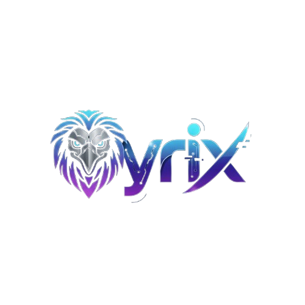

# QyrixAI - AI Avatar Chat Application

<div align="center">



**An interactive AI-powered avatar chat application with voice recognition, text-to-speech, and real-time video animations**

[Features](#-features) • [Installation](#-installation) • [Usage](#-usage) • [API Documentation](#-api-documentation)

</div>

---

## 📋 Table of Contents

- [Overview](#-overview)
- [Features](#-features)
- [Architecture](#-architecture)
- [Prerequisites](#-prerequisites)
- [Installation](#-installation)
- [Configuration](#-configuration)
- [Usage](#-usage)
- [Project Structure](#-project-structure)
- [API Documentation](#-api-documentation)
- [Technologies Used](#-technologies-used)
- [Troubleshooting](#-troubleshooting)
- [Contributing](#-contributing)
- [License](#-license)

---

## 🎯 Overview

QyrixAI is a cutting-edge AI avatar chat application that enables natural voice-based conversations with AI-powered virtual assistants. The application features multiple AI personas, each with unique personalities and specialized knowledge bases, providing an immersive conversational experience through voice recognition, AI-generated responses, and synchronized video animations.

### Key Highlights

- **Multiple AI Personas**: Choose from different AI assistants with unique personalities
- **Voice-to-Voice Interaction**: Seamless speech recognition and text-to-speech synthesis
- **Video Avatar Integration**: Real-time video animations synchronized with speech
- **Knowledge Base Integration**: Specialized knowledge bases for charity information and career guidance
- **Local LLM Support**: Powered by Ollama for privacy-focused, offline AI interactions

---

## ✨ Features

### Core Features

- 🎤 **Voice Recognition**: Real-time speech-to-text using Web Speech API
- 🔊 **Text-to-Speech**: Natural voice synthesis with language detection
- 🎬 **Video Avatar**: Synchronized video animations during conversations
- 🤖 **Multiple AI Personas**:
  - **Ahmed**: Kid-friendly assistant (6-8 years old personality)
  - **Aasho**: Confident, flirty HR-style assistant with career guidance
- 📚 **Knowledge Base Integration**:
  - Saylani Welfare information
  - Career and institutional guidance
- 💬 **Conversation History**: Per-user conversation context management
- 🌐 **CORS-Enabled API**: Cross-origin support for flexible frontend integration

### Technical Features

- FastAPI backend with async support
- Ollama integration for local LLM inference
- RESTful API architecture
- Responsive web interface
- Real-time status updates
- Error handling and fallback mechanisms

---

## 🏗️ Architecture

```
┌─────────────────┐
│   Frontend      │
│  (HTML/CSS/JS)  │
│                 │
│  - Voice Input  │
│  - Video Avatar │
│  - TTS Output   │
└────────┬────────┘
         │ HTTP/REST
         │
┌────────▼────────┐
│   Backend       │
│   (FastAPI)     │
│                 │
│  - Chat API     │
│  - KB Search    │
│  - History Mgmt │
└────────┬────────┘
         │
┌────────▼────────┐
│    Ollama       │
│  (Local LLM)    │
│                 │
│  - llama3.2:1b  │
│  - Other models │
└─────────────────┘
```

---

## 📦 Prerequisites

Before you begin, ensure you have the following installed:

- **Python 3.8+** ([Download](https://www.python.org/downloads/))
- **Ollama** ([Download](https://ollama.com))
- **Modern Web Browser** (Chrome, Edge, or Firefox with Web Speech API support)
- **Git** (for cloning the repository)

### Python Packages

The following Python packages are required:
- `fastapi`
- `uvicorn`
- `requests`
- `python-dotenv`
- `pydantic`

---

## 🚀 Installation

### 1. Clone the Repository

```bash
git clone <repository-url>
cd "ai avatar chat git code"
```

### 2. Install Ollama

1. Download and install Ollama from [https://ollama.com](https://ollama.com)
2. Pull the required model:

```bash
ollama pull llama3.2:1b
```

For better quality (slower), you can use:
```bash
ollama pull llama3.2
```

### 3. Set Up Python Backend

1. Navigate to the Backend directory:

```bash
cd Backend
```

2. Create a virtual environment (recommended):

```bash
# Windows
python -m venv venv
venv\Scripts\activate

# Linux/Mac
python3 -m venv venv
source venv/bin/activate
```

3. Install dependencies:

```bash
pip install fastapi uvicorn requests python-dotenv pydantic
```

Or create a `requirements.txt` file:

```txt
fastapi>=0.104.0
uvicorn>=0.24.0
requests>=2.31.0
python-dotenv>=1.0.0
pydantic>=2.0.0
```

Then install:

```bash
pip install -r requirements.txt
```

### 4. Configure Environment Variables (Optional)

Create a `.env` file in the `Backend` directory:

```env
OLLAMA_BASE_URL=http://localhost:11434
OLLAMA_MODEL=llama3.2:1b
```

If not provided, defaults will be used.

### 5. Prepare Knowledge Base Files (Optional)

Place the following files in the `Backend` directory if you want enhanced functionality:

- `Saylani_Welfare_Knowledge_Base.txt` - For Saylani Welfare information
- `AshuAI_Complete_Training_Data.txt` - For career guidance (Aasho bot)

---

## ⚙️ Configuration

### Backend Configuration

The backend can be configured via environment variables or defaults:

| Variable | Default | Description |
|----------|---------|-------------|
| `OLLAMA_BASE_URL` | `http://localhost:11434` | Ollama API endpoint |
| `OLLAMA_MODEL` | `llama3.2:1b` | Ollama model to use |

### Frontend Configuration

Each HTML file contains configuration at the top of the script section:

```javascript
const CONFIG = {
  BACKEND_URL: "http://127.0.0.1:8001",  // Backend URL
  CHAT_ENDPOINT: "/chat",                 // API endpoint
  VIDEO_SRC: "../video.mp4"               // Avatar video path
};
```

**Port Configuration:**
- `main_ollama.py` (Ahmed bot): Port 8001
- `aashu_ollama.py` (Aasho bot): Port 8002

---

## 🎮 Usage

### Starting the Backend

1. **For Ahmed Bot** (Kid-friendly assistant):

```bash
cd Backend
python main_ollama.py
```

The server will start on `http://127.0.0.1:8001`

2. **For Aasho Bot** (Career guidance assistant):

```bash
cd Backend
python aashu_ollama.py
```

The server will start on `http://127.0.0.1:8002`

### Starting the Frontend

1. Open the desired HTML file in a web browser:
   - `Frontend/index_ollama.html` - Ahmed bot interface
   - `Frontend/aashobot.html` - Aasho bot interface
   - `Frontend/madnibot.html` - Alternative Ahmed interface

2. **Important**: Use a local web server for best results (CORS and file access):

```bash
# Using Python's built-in server
cd Frontend
python -m http.server 8080

# Then open: http://localhost:8080/index_ollama.html
```

Or use any other local web server (Live Server extension in VS Code, etc.)

### Using the Application

1. **Grant Microphone Permission**: When prompted, allow microphone access
2. **Click the Microphone Button**: Start speaking
3. **Wait for Response**: The AI will process and respond via voice
4. **Continue Conversation**: The conversation history is maintained automatically

### Browser Compatibility

- ✅ **Chrome/Chromium**: Full support
- ✅ **Microsoft Edge**: Full support
- ⚠️ **Firefox**: Limited Web Speech API support
- ❌ **Safari**: Limited support

---

## 📁 Project Structure

```
ai avatar chat git code/
│
├── Backend/
│   ├── main_ollama.py              # Ahmed bot backend (port 8001)
│   ├── aashu_ollama.py             # Aasho bot backend (port 8002)
│   ├── venv/                        # Python virtual environment
│   ├── .env                         # Environment variables (optional)
│   ├── Saylani_Welfare_Knowledge_Base.txt    # Knowledge base (optional)
│   └── AshuAI_Complete_Training_Data.txt    # Career data (optional)
│
├── Frontend/
│   ├── index_ollama.html           # Ahmed bot interface
│   ├── aashobot.html               # Aasho bot interface
│   ├── madnibot.html               # Alternative Ahmed interface
│   ├── aashu.mp4                   # Aasho avatar video
│   ├── madni3.mp4                  # Ahmed avatar video
│   ├── Qyrix.png                   # Logo
│   └── sunrise.jpg                 # Background image
│
└── README.md                        # This file
```

---

## 📡 API Documentation

### Base URLs

- **Ahmed Bot**: `http://127.0.0.1:8001`
- **Aasho Bot**: `http://127.0.0.1:8002`

### Endpoints

#### POST `/chat` (Ahmed Bot) or `/aasho_chat` (Aasho Bot)

Send a message to the AI assistant.

**Request Body:**
```json
{
  "text": "Hello, how are you?",
  "user_id": "default_user"
}
```

**Response:**
```json
{
  "reply": "Hi! I'm doing great, thanks for asking! How can I help you today?"
}
```

#### GET `/`

Health check endpoint.

**Response:**
```json
{
  "status": "Ahmed Ollama backend is live 🚀",
  "ollama_url": "http://localhost:11434",
  "model": "llama3.2:1b",
  "note": "Make sure Ollama is running locally"
}
```

#### GET `/models`

Get available Ollama models.

**Response:**
```json
{
  "models": ["llama3.2:1b", "llama3.2", ...]
}
```

#### POST `/clear`

Clear conversation history for a user.

**Query Parameters:**
- `user_id` (optional): User ID (default: "default_user")

**Response:**
```json
{
  "status": "Conversation history cleared"
}
```

---

## 🛠️ Technologies Used

### Backend

- **FastAPI**: Modern, fast web framework for building APIs
- **Uvicorn**: ASGI server for FastAPI
- **Ollama**: Local LLM inference engine
- **Python-dotenv**: Environment variable management
- **Pydantic**: Data validation using Python type annotations
- **Requests**: HTTP library for API calls

### Frontend

- **HTML5**: Structure and semantic markup
- **CSS3**: Styling and animations
- **JavaScript (ES6+)**: Client-side logic
- **Web Speech API**: Speech recognition and synthesis
- **Fetch API**: HTTP requests

### AI/ML

- **Ollama**: Local large language model inference
- **LLaMA 3.2**: Language model (1B and larger variants)

---

## 🔧 Troubleshooting

### Common Issues

#### 1. "Cannot connect to Ollama"

**Solution:**
- Ensure Ollama is installed and running
- Check if Ollama is accessible at `http://localhost:11434`
- Verify the model is pulled: `ollama pull llama3.2:1b`

#### 2. "Voice recognition not supported"

**Solution:**
- Use Chrome or Edge browser
- Ensure microphone permissions are granted
- Check browser console for errors

#### 3. "Backend offline" error

**Solution:**
- Verify backend is running: `python main_ollama.py` or `python aashu_ollama.py`
- Check if the correct port is configured in frontend
- Ensure CORS is enabled (default: enabled for all origins)

#### 4. Slow response times

**Solution:**
- Use a faster model: `llama3.2:1b` (default) is optimized for speed
- Reduce `num_predict` in backend code for shorter responses
- Ensure adequate system resources (CPU/RAM)

#### 5. Video not playing

**Solution:**
- Verify video file paths in HTML configuration
- Check browser console for CORS or file access errors
- Use a local web server instead of opening HTML directly

### Debug Mode

Enable verbose logging by checking the browser console (F12) and backend terminal output.

---

## 🤝 Contributing

Contributions are welcome! Please follow these steps:

1. Fork the repository
2. Create a feature branch (`git checkout -b feature/AmazingFeature`)
3. Commit your changes (`git commit -m 'Add some AmazingFeature'`)
4. Push to the branch (`git push origin feature/AmazingFeature`)
5. Open a Pull Request

### Development Guidelines

- Follow PEP 8 for Python code
- Use meaningful variable and function names
- Add comments for complex logic
- Test your changes before submitting

---

## 📄 License

This project is provided as-is for educational and personal use. Please refer to the license file in the repository for more details.

---

## 🙏 Acknowledgments

- **Ollama** for providing an excellent local LLM solution
- **FastAPI** team for the amazing web framework
- All contributors and users of this project

---

## 📞 Support

For issues, questions, or contributions:

- Open an issue on GitHub
- Check existing issues for solutions
- Review the troubleshooting section above

---

<div align="center">

**Made with ❤️ by the QyrixAI Team**

⭐ Star this repo if you find it helpful!

</div>

